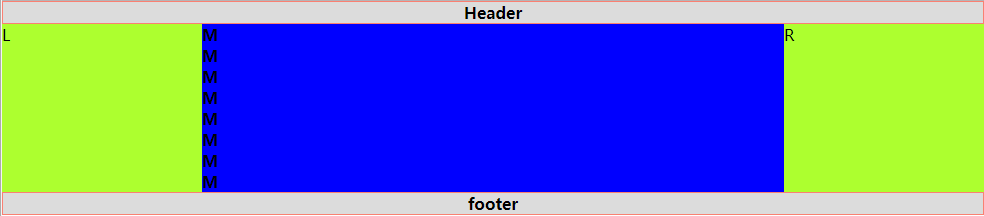
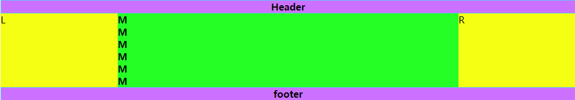

# 圣杯布局与双飞燕布局
### 负外边距
- 定位和浮动都会脱离文档流，但是 margin 负值不会脱离文档流，只是             在视觉上感觉像飘起来一样
- 如果一个块级元素上存在文字 
	- 定位 -- 启用定位的块级元素可以完全覆盖住这个块级元素及上面的文字                          
	- 浮动 -- 不会覆盖会出现文字环绕效果                                                    
	- margin 为负 -- 文字可见

### 三列布局（两边固定，中间自适应）

- 圣杯布局
	- 需求 
    	- 两边固定，中间自适应
    	- 先加载 middle 内容
    	- 等高布局（实现高度统一）
    	
	- 步骤
    	- 布局：有头、有尾、有内容
    	- 先加载 middle 内容
    	- 使用浮动让三者处于一行，出现高度塌陷，清除浮动
	    - left 上去：margin-left：-100%
		- right 同理
	    - middle 内容未显示：content -- padding：0 200px
	    - 此时用相对定位把 left、right 拉回来
	    - 最小宽度问题：min - width：600px
   
	- 问题：内容过多，文字溢出未解决（等高布局解决）
	- 代码实现
		```
				<!DOCTYPE html>
				<html lang="en">
				<head>
	  				<meta charset="UTF-8">
	  				<title>Title</title>
		  			<style type="text/css">
						* {
							margin: 0;
					      	padding: 0;
					    }
					    #header,#footer{
					      	background: gainsboro;
					      	border: 1px solid salmon;
					      	text-align: center;
					    }
						/*清除浮动:让浮动的子元素可以撑开它的父元素*/
					    .clearfix{
					      	/*触发haslayout*/
					      	*zoom: 1;
					    }
					    .clearfix:after{
					      	content:'';
					      	display: block;
					      	clear: both;
					    }
					
					    /*为body设置最小宽度*/
					    body{
					      	min-width: 600px;
					    }
					    #left,#right{
					      	/*设置左右相对定位并且让元素撑开位置*/
					      	position: relative;
					      	background: greenyellow;
					      	float: left;
					      	width: 200px; /*两边固定*/
					    }
					    #left{
					      	left:-200px;
					      	margin-left: -100%; 
						 	/*left设置负外边距*/
					    }
					
					    #right{
					      	right:-200px;
					      	margin-left: -200px; 
							/*right设置负外边距*/
					    }
					    #middle{
					      	background: blue;
					      	/*左右包裹必须浮动.并进行宽度修正 100% */
					      	float: left;
					      	width: 100%;
					    }
						#container{
					      	/*显示middle区域*/
					      	padding: 0 200px;
							/*伪等高父元素设置overflow:hidden*/
					      	overflow: hidden;
					    }
					    /*伪等高实现*/
					    #left,#right,#middle{
					      	padding-bottom: 1000px;
					      	margin-bottom: -1000px;
					    }

	  				</style>
				</head>
				<body>
	  				<div id="header">
	      				<h4>Header</h4>
	  				</div>
	  				<div id="container" class="clearfix">
						<div id="middle">
					    	<h4>M</h4>
					      	<h4>M</h4>
					      	<h4>M</h4>
					      	<h4>M</h4>
					      	<h4>M</h4>
					      	<h4>M</h4>
					      	<h4>M</h4>
					      	<h4>M</h4>
					    </div>
		    			<div id="left">L</div>
		    			<div id="right">R</div>
	  				</div>
					<div id="footer">
	    				<h4>footer</h4>
	  				</div>
				</body>
				</html>
		```


- 双飞翼布局
	- 步骤
    	- 布局：有头、有尾、有内容
        - 先加载 middle 内容
        - 使用浮动让三者处于一行，出现高度塌陷，清除浮动
        - 给 middle 设置宽度为 100%
        - left 上去：margin-left：-100%
        - right 同理
        - 内容区处理：改变 DOM 结构
            ```
             #middle-inner{
             	margin-left：200px；
                margin-right：200px；
             }
			```
		- 最小宽度问题：min-width：600px
        - 等高处理

	- 优点
		- 内容部分（中间列）优先加载
        - 结构上仅仅添加了一个父级容器
        - 任何一列都可以作为最高列

	- 缺点
		- 多写了一层 html 结构

	- 代码实现
		```
			<!DOCTYPE html>
			<html lang="en">
			<head>
	  			<meta charset="UTF-8">
	  			<title>Title</title>
	  			<style type="text/css">
	    			* {
	      				margin: 0;
	      				padding: 0;
	    			}
	    			/*清除浮动:让浮动的子元素可以撑开它的父元素*/
	    			.clearfix{
	      				/*触发haslayout*/
	      				*zoom: 1;
	    			}
	    			.clearfix:after{
					     content:'';
					     display: block;
					     clear: both;
	    			}
	    			/*设置body最小宽度*/
				    body{
				      	min-width: 600px;
				    }
				    #header,#footer{
				      	background: #cc71ff;
				      	border: 1px solid #5fc4fa;
				      	text-align: center;
				    }	
				    #left,#right{
				      	background: #f4ff14;
				      	width: 200px; 
						/*定死高度并且同时浮动*/
				      	float: left;
				    }
				    #left{
				     	margin-left: -100%; 
					 	/*left设置负外边距*/
				    }
				    #right{
				     	margin-left: -200px; 
						/*right设置负外边距*/
				    }
				    #middle{
				      	background: #26ff26;
				      	width: 100%;
				      	float: left; 
						/*浮动*/
				    }
				    /*显示出内容*/
				    #middle-inner{
				      	padding: 0 200px; 
						/*优先使用padding*/
				    }
				    /*伪等高*/
				    #left,#right,#middle{
				      	padding-bottom: 1000px;
				      	margin-bottom: -1000px;
				    }
				    #container{
				      	overflow: hidden;
				    }
	
	  			</style>
			</head>
			<body>
				<div id="header">
			    	<h4>Header</h4>
			  	</div>
	  			<div id="container" class="clearfix">
		    		<div id="middle">
		      			<div id="middle-inner">
		        			<!--嵌套div 在里面显示内容 -->
		        			<h4>M</h4>
		      			</div>
	    			</div>
	    			<div id="left">L</div>
	    			<div id="right">R</div>
	  			</div>
	  			<div id="footer">
	    			<h4>footer</h4>
	  			</div>
			</body>
			</html>
		```

- 等高布局
	-  给中间的所有元素设置 padding-bottom：10000px；margin-bottom：-10000px   

- 圣杯布局与双飞翼布局的对比
	- 相同点
		- 两种方法的基本思路都相同，首先让中间盒子 100% 宽度占满同一高度空间，在左右盒子被挤出中间盒子所在区域时，使用 margin-left 的负值将左右两个盒子拉回与中间盒子同一高度的空间，接下来进行一些调整避免中间盒子的内容被左右盒子遮挡
    - 不同点
	    - 圣杯布局 -- 设置父元素的 padding 值为左右盒子留出空位，再利用相对布局对左右盒子调整位置占据 padding 出来的空位
        - 双飞翼布局 -- 在中间盒子里再增加一个子盒子，直接设置这个子盒子的 margin 值来让出空位，而不用再调整左右盒子                                      


### 负外边距
- 定位和浮动都会脱离文档流，但是 margin 负值不会脱离文档流，只是在视觉上感觉像飘起来一样
- 如果一个块级元素上存在文字
	- 定位 -- 启用定位的块级元素可以完全覆盖住这个块级元素及上面的文字                           
    - 浮动 -- 不会覆盖会出现文字环绕效果
	- margin 为负 -- 文字可见