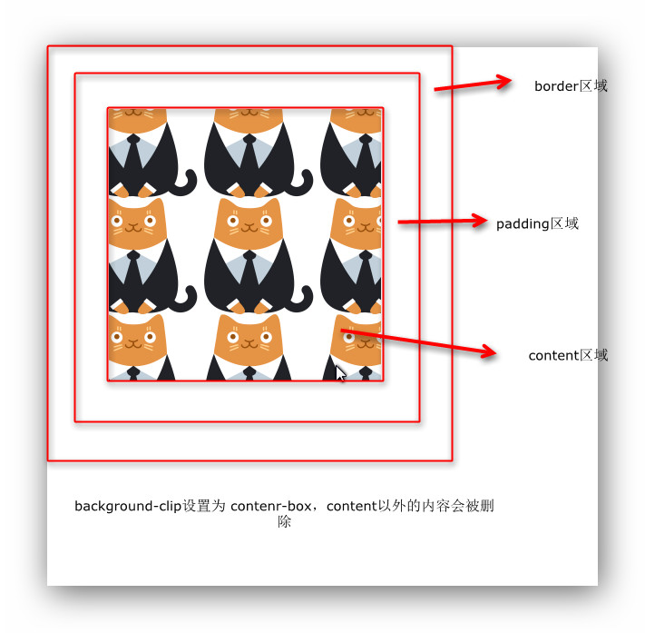

# CSS 3 背景与渐变

### CSS 3 背景 
 
#### background-cilp
                
- 定义 -- 指定背景的绘制区域
- 语法 -- background-cilp：border-box / padding-box / content-box
- 属性介绍
	- border-box：边框区域也会显示平铺的背景图
	 
	- padding-box：内边距以外的背景图会被裁切掉
	
	- content-box：内容区以外的背景图会被裁切掉
	

#### background-origin
                
- 定义 -- 设置背景图像左上角所处的位置
- 语法 -- background-orgin：border-box / padding-box / content-box
- 属性介绍
    - border-box：背景图像的左上角起始位置位于 border 的左上角
    
    - padding-box：背景图像的左上角起始位置位于 padding的左上角
    
    - content-box：背景图像的左上角起始位置位于 content的左上角
    
    - 注：background-position 设置的是背景图的位置（水平与垂直方向上的偏移量）

#### background-size
                
- 定义 -- 设置背景图像的大小
- 语法 -- background-size：number / % / cover / contain
- 属性介绍
	- number：设置背景图像的高度和宽度（注：如果只写一个数值，第二个数值默认为 auto）
    - 百分比：0% ~ 100% 之间的任何值，此时百分比的值参照于 div 的大小进行设置
    - cover：将背景图等比例缩放填满整个容器， 如宽度小于高度，当宽度达到 100% 时，高度会溢出，但是具体那部分溢出还是取决于定位
    - contain：将背景图等比例缩放直至某一边达到容器的边缘，如果高度比较小，高度就会有空白区域出现 
            
#### background-image

- 定义 -- 设置多个背景图像
- 语法 -- background-image：url（‘ 1.jpg ’），url（‘ 2.jpg ’）……（注：使用逗号把图片分开）
- 注：引入多个背景图片时，前面的图片会覆盖后面的图片
 
#### background 的简写形式

- 定义 -- 可以在一个声明中设置所有的背景属性
- 语法 -- background：color position size repeat origin clip attachment image
        
### CSS 3 渐变

- 定义 -- 可以在两个或者多个指定颜色之间显示平移的过渡
- 类型
	- 线性渐变
    	- 定义 -- 沿着一根轴线改变颜色，从起点到终点进行渐变
        - 语法 -- background：linear-gradient（方向，开始颜色，结束颜色）
        - 方向分类
			- 方向从上到下（默认）
			  兼容性
				background：-webkit-linear-gradient（red,blue）
                background：-moz-linear-gradient（red，blue）
                background：-o-linear-gradient（red，blue）
                background：linear-gradient（red，blue）
            - 方向从左到右
              兼容性
				background：-webkit-linear-gradient（left，red,blue）
                background：-moz-linear-gradient（right，red，blue）
                background：-o-linear-gradient（right，red，blue）
                background：linear-gradient（to right，red，blue）
              兼容描述
				webkit 内核，写开始点的方向
                moz 和 o 内核，写结束点的方向
                标准：to - 结束方向   
            - 对角
              兼容性
				background：-webkit-linear-gradient（left top，red,blue）
                background：-moz-linear-gradient（right bottom，red，blue）
                background：-o-linear-gradient（right bottom，red，blue）
                background：linear-gradient（to right bottom，red，blue）
              兼容描述
				webkit 内核 --（开始的水平方向的位置 开始的垂直方向的位置，red,blue）
                moz 和 o 内核 --（结束的水平方向的位置 结束的垂直方向的位置，red,blue）
                标准 --（to 结束的水平方向的位置 结束的垂直方向的位置，red,blue）
            - 角度
              语法 -- background：linear-gradient（角度，red，blue）；
              角度说明 -- 0 deg 将创建一个从上到下的渐变，90 deg 将创建一个从左到右的渐变
              颜色结点 -- 默认每个颜色均匀分布
              - background：linear-gradient（red 10%，blue 20%，green 30%，yellow 40%）；
              从 0% 到 10% 设置为红色，从 10% 到 20% 设置为红色到蓝色的渐变，从 20% 到 30% 设置为蓝色到绿色的渐变，从 30% 到 40% 设置为绿色到黄色的渐变
              - background：linear-gradient（red 10%，blue）；
                从 0% 到 10% 设置为红色，从 10% 到 100% 设置为红色到蓝色的渐变（最后不填写百分比默认到 100%）
              - background：linear-gradient（red，blue 30%）；
                从 0% 到 30% 设置为红色到蓝色的渐变，剩余部位都为蓝色
              - background：linear-gradient（rgba（255，0，0，0），rgba（255，0，0，1））；
                设置为由透明色变为不透明
                    
			- 重复渐变
			    - 语法 -- background：repeating-linear-gradient（90 deg，red 0%，blue 20%）
		        - 注：把元素整体宽度看成 100%
                
	- 径向渐变
        - 定义 -- 从起点到终点，呈现圆形渐变
        - 语法 -- background：radial-gradient（形状尺寸，开始颜色，结束颜色）
        - 形状分类
	        - circle -- 圆形
            - ellipse -- 椭圆形
            - 注：当元素宽高一样时，参数无论设置什么，都是圆形
        - 颜色结点
		    - background：radial-gradient（circle，red 50%，blue 70%）
            - 注：此时的百分比指的是半径的距离，因此上式的含义为 0~50% 为红色，50%~70% 为红到蓝的渐变，70%~100% 为蓝色
        - 尺寸大小
            - closest-side -- 最近边
              background：radial-gradient（closest-side circle，red，blue）
            - farthest-side -- 最远边
              background：radial-gradient（farthest-side circle，red，blue）
            - closest-corner -- 最近角
              background：radial-gradient（closest-corner circle，red，blue）
            - farthest-side -- 最远角
              background：radial-gradient（farthest-corner circle，red，blue）
            - 注：径向渐变本身可以设置起点的位置，但由于各大浏览器不支持，所以无法实现，同时最近角与最远角也就无法实现
                    
		- 重复渐变
	        - 语法 -- background：repeating-radial-gradient（red 0%，blue 20%）
                
	- IE 渐变
        - 语法  
       	`filter:progid:DXImageTransform.Microsoft.gradient(startColorstr='startcolor',endColorstr='endColor',GradientType=0)`
        - 注：括号内为可变量
        - GradientType 渐变的类型
	        - 0：从上到下
            - 1：从左到右
            - 2：由结束颜色到最深的黑色渐变（注：有 beg，始终会显示由蓝色到黑色的渐变）
