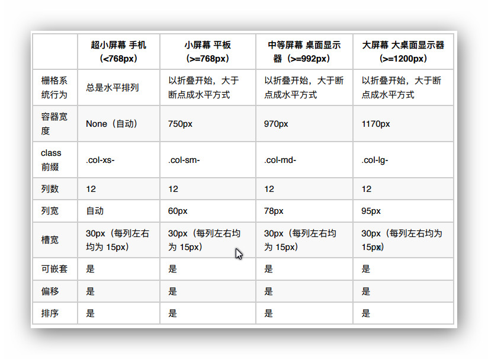
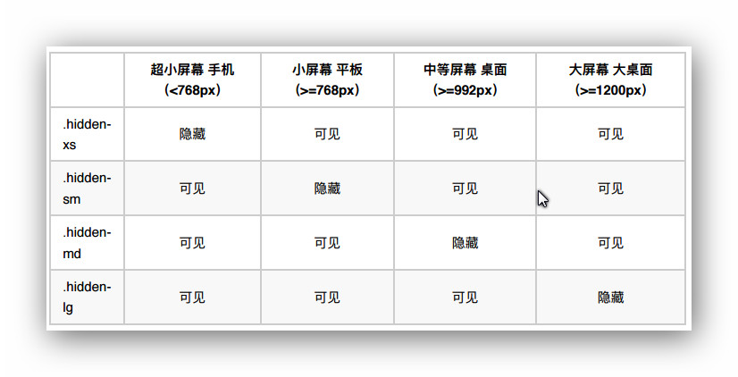
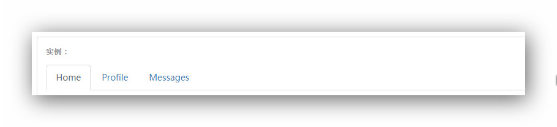
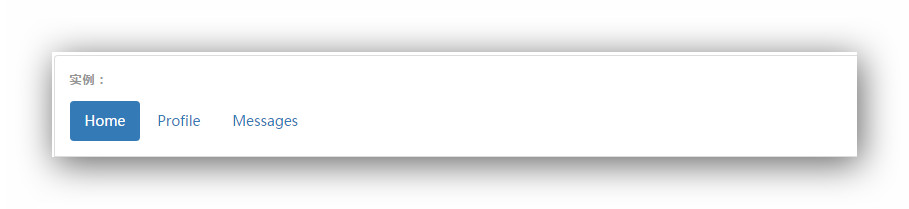
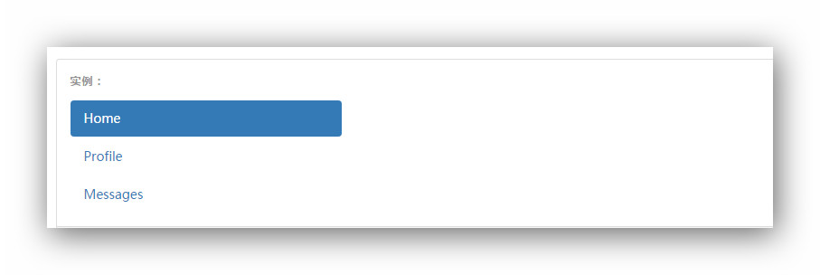
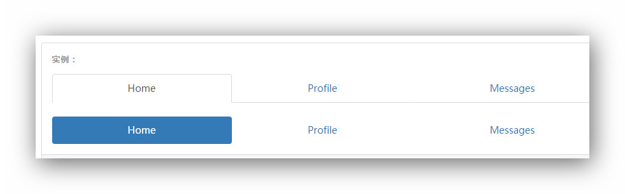
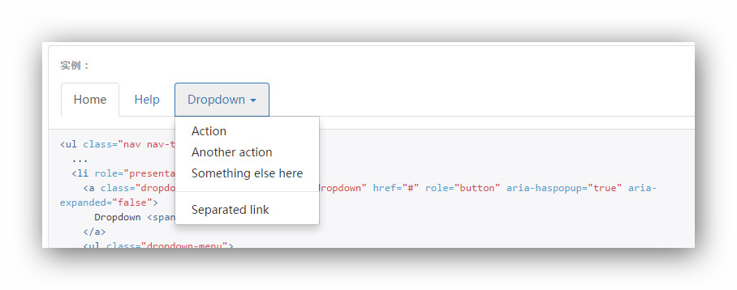

# BOOTSTRAP
### BOOTSTRAP 概述
- Bootstrap 是 Twitter 公司开发的⼀一个基于 HTML、CSS、JavaScript 的技术框架，符合 HTML、CSS 规范，且代码简介、视觉优美
- Bootstrap 集合 HTML、CSS 和 JavaScript，使用了最新的浏览器技术，为实现快速开发提供了一套前端工具包。使用Bootstrap 不仅可以构建出非常优雅的 HTML 页面，而且占用资源非常少，使用 gzip 压缩后大小仅有 10KB。并且 Bootstrap 在跨浏览器兼容方面变现也很好

### 选择 BOOTSTRAP 的理由
- Bootstrap 的 HTML 是基于 HTML5 的最新技术
- Bootstrap 可以快速实现响应式页面
- Bootstrap 继承了非常友好的 CSS 样式表，对于非技术人员也可以制作出非常漂亮的网页

### BOOTSTRAP 提供的功能
- Bootstrap 分为以下几个模块
	- 全局 CSS 样式：提供了栅格系统、表格、表单、按钮等集成样式
	- 组件：提供了下拉菜单、输入框、导航、列表等组件（静态）
	- 插件：提供了模态框、滚动监听、警告框、弹出框等插件（动态）

### BOOTSTRAP 使用的两种方式
- 将 Bootstrap 提供的压缩包下载，导入工程目录中使用
- 使用 CDN 加速服务
	- 例
		```
			<!-- 新 Bootstrap 核心 CSS 文件 -->
			<link rel="stylesheet" href="//cdn.bootcss.com/bootstrap/3.3.6/css/bootstrap.min.css">
			<!-- 可选的Bootstrap主题文件（一般不用引入） -->
			<link rel="stylesheet" href="//cdn.bootcss.com/bootstrap/3.3.6/css/bootstrap-theme.min.css
			<!-- jQuery文件。务必在bootstrap.min.js 之前引入 -->
			<script src="//cdn.bootcss.com/jquery/1.11.3/jquery.min.js"></script>
			<!-- 最新的 Bootstrap 核心 JavaScript 文件 -->
			<script src="//cdn.bootcss.com/bootstrap/3.3.6/js/bootstrap.min.js"></script>
		```

### BOOTSTRAP 的基本模板
	
		<!DOCTYPE html>
		<html lang="zh-CN">
		<head>
			<!-- 设置当前 HTML 页面的编码格式为 UTF-8 -->
			<meta charset="utf-8">
			<!-- 设置 IE 的兼容模式 -->
			<meta http-equiv="X-UA-Compatible" content="IE=edge">
			<!-- 设置移动优先 -->
			<meta name="viewport" content="width=device-width, initial-scale=1">
			<!-- 上述3个meta标签必须放在最前面，任何其他内容都必须跟随其后！ -->
			<title>Bootstrap最基本的HTML模板</title>
			<!-- 导⼊入 Bootstrap 框架的 CSS 文件 -->
			<link href="bootstrap/css/bootstrap.min.css" rel="stylesheet">
			<!--html5shiv.js 文件解决 IE8 及之前版本的浏览器支持 HTML5 元素的问题。
			respond.js 文件解决 IE8 及之前版本的浏览器支持 CSS 3 的媒体查询问题。-->
			<!--[if lt IE 9]>
			<script src="bootstrap/js/html5shiv.min.js"></script>
			<script src="bootstrap/js/respond.min.js"></script>
			<![endif]-->
		</head>
		<body>
			<h1>你好，世界！</h1>
			<!--由于 Bootstrap 是基于 jQuery 实现的核心 js 功能,所以想要使⽤用 Bootstrap 提供的插件功能,需要先导入 jQuery 文件。-->
			<script src="bootstrap/js/jquery-1.11.3.js"></script>
			<!-- 导⼊入 Bootstrap 框架的 js 文件 -->
			<script src="bootstrap/js/bootstrap.min.js"></script>
		</body>
		</html>

# 全局 CSS 样式
## 概述
### HTML5 文档类型
- Bootstrap 使用到的某些 HTML 元素和 CSS 属性需要将页面设置为 HTML5 文档类型。

### 移动设备优先
- Bootstrap 是移动设备优先的。为了确保适当的绘制和触屏缩放，需要在 `<head>` 之中添加 viewport 元素。
- 在移动设备浏览器上，通过为 viewport 设置 meta 属性为 user-scalable=no 可以禁用其缩放功能。这样禁用缩放功能后，用户只能滚动屏幕，就能让你的网站看上去更像原生应用的感觉。

### 布局容器
- Bootstrap 提供了以下两种布局容器
	- .container 用于固定宽度并支持响应式布局的容器
	- .container-fluid 用于 100% 宽度，占据 viewport 的容器
	- 注：这两种容器不能互相嵌套

## 栅格系统
### 什么是栅格系统
- 栅格系统用于通过一系列的行（row）与列（column）的组合来创建页面布局，内容就可以放入这些创建好的布局中
- Bootstrap 提供的栅格系统的主要特点
	- 行的宽度，可以是固定宽度，也可以是相对宽度（100%）
	- 一行中最多可以包含 12 个列。如果一行中包含的列大于 12 ，多余的列则被作为一个整体另起一行排列
	- Bootstrap 根据 4 种分辨率提供比不同的栅格系统预定义样式

### 栅格系统的工作原理
- 栅格系统必须指定一个容器元素，该元素的 class 必须为 .container（固定宽度）或 .container-
fluid（100%宽度）。
- 作为“行”的元素必须作为容器元素的直接子元素，并且 class 设置为 .row。
- 作为“列”的元素必须是“行”元素的直接子元素（“行”元素的子元素不不能直接包含内容，内容应该被包含在“列”元素中。），并且一行最多允许创建 12 列。

### 栅格系统的参数


### 响应式工具
- 通过单独或联合使用以下列出的 class，可以针对不同屏幕尺⼨隐藏或显示页面内容


# 组件
## 导航
### 两种导航样式
- 标签页式导航
	- 标签页式导航，就是为作为标签页的`<ul>`元素添加 class 为 .nav-tab 的样式
	- 注
		- .nav-tabs 类依赖 .nav 基类
		- 默认被点击的样式为 active
		- 实现动态切换效果，需要为作为导航项的元素设置 data-togle = "tab" 
	- 实例代码
		```
			<div class="container">
				<h3>标签页式导航</h3>
				<ul class="nav nav-tabs">
					<li data-toggle="tab" class="active"><a href="#">Home</a></li>
					<li data-toggle="tab"><a href="#">Profile</a></li>
					<li data-toggle="tab"><a href="#">Messages</a></li>
				</ul>
			</div>
		```
	- 样式
		
- 胶囊式标签页
	- 胶囊式标签页，就是为作为标签页的`<ul>`元素添加 class = .nav-pills 的样式
		- 水平方向（胶囊式标签页的默认方向）
			- 实例代码
				```
					<div class="container">
						<h3>胶囊式标签页</h3>
						<ul class="nav nav-pills">
							<li data-toggle="tab" class="active"><a href="#">Home</a></li>
							<li data-toggle="tab"><a href="#">Profile</a></li>
							<li data-toggle="tab"><a href="#">Messages</a></li>
						</ul>
					</div>
				```
			- 样式
				
		- 垂直方向
			- 实例代码
				```
					<div class="container">
						<h3>垂直⽅方向的胶囊式标签页</h3>
						<ul class="nav nav-pills nav-stacked">
							<li data-toggle="tab" class="active"><a href="#">Home</a></li>
							<li data-toggle="tab"><a href="#">Profile</a></li>
							<li data-toggle="tab"><a href="#">Messages</a></li>
						</ul>
					</div>
				```
			- 样式
				

### 两端对齐
- 在大于 768px 的屏幕上，通过 .nav-justified 类可以很容易的让标签页或胶囊式标签呈现出同等宽度。在小屏幕上，导航链接呈现堆叠样式。
- 代码实例
	```
		<div class="container">
			<ul class="nav nav-tabs nav-justified">
				<li data-toggle="tab" class="active"><a href="#">Home</a></li>
				<li data-toggle="tab"><a href="#">Profile</a></li>
				<li data-toggle="tab"><a href="#">Messages</a></li>
			</ul>
			<ul class="nav nav-pills nav-justified">
				<li data-toggle="tab" class="active"><a href="#">Home</a></li>
				<li data-toggle="tab"><a href="#">Profile</a></li>
				<li data-toggle="tab"><a href="#">Messages</a></li>
			</ul>
		</div>
	```
- 样式
	

### 嵌套下拉菜单
- 实例代码
	```
		<div class="container">
			<ul class="nav nav-pills">
				<li data-toggle="tab" class="active"><a href="#">Home</a></li>
				<li data-toggle="tab"><a href="#">Help</a></li>
				<li data-toggle="tab" class="dropdown">
					<a class="dropdown-toggle" data-toggle="dropdown">
						Dropdown
						<span class="caret"></span>
					</a>
					<ul class="dropdown-menu">
						<li><a href="#">Action</a></li>
						<li><a href="#">Another action</a></li>
						<li><a href="#">Something else here</a></li>
						<li><a href="#">Separated link</a></li>
					</ul>
				</li>
			</ul>
		</div>
	```
- 样式
	

## 导航条
### 导航条样式
- 默认样式的导航条
	- 默认样式的导航条，需要为作为容器元素的`<nav>`元素，添加 .navbar-default 样式
	- 实例代码
		```
			<div class="container">
				<nav class="navbar navbar-default">
					<!-- 导航条组件 -->
				</nav>
			</div>
		```
- 反色导航条
	- 通过添加 .navbar-inverse 类可以改变导航条的外观
	- 实例代码
		```
			<div class="container">
				<nav class="navbar navbar-inverse">
					<!-- 导航条组件 -->
				</nav>
			</div>
		```

### 导航条组件
- 品牌图标
	- 一般在导航条添加网站的名称或图标，使用 `<a>` 元素，并且为其设置 class 为 .navbar-brand
	- 实例代码
		```
			<div class="container">
				<nav class="navbar navbar-default">
					<a class="navbar-brand" href="#">
						
					</a>
				</nav>
			</div>
		```
	- 注：.navbar-brand 样式设置的高度为 50px，并且内边距为 15px。所以，如果使用图标的话，一定设置图标的高度为 20px
- 表单
	- 在导航条添加表单的话，需要为 `<form>` 元素设class 为 navbar-form 。表单内组件可以呈现很好的垂直对齐，并且较窄的宽度中呈现折叠状态
	- 实例代码
		```
			<div class="container">
				<nav class="navbar navbar-default">
					<form class="navbar-form">
						<div class="form-group">
							<input type="text" class="form-control" placeholder="Search">
						</div>
						<button type="submit" class="btn btn-default">Submit</button>
					</form>
				</nav>
			</div>
		```
- 按钮
	- 如果要在导航条中添加非表单内的按钮时，需要为其添加 navbar-btn 样式，使之在导航条中垂直居中
	- 实例代码
		```
			<div class="container">
				<nav class="navbar navbar-default">
					<button class="btn btn-default navbar-btn">Sign in</button>
				</nav>
			</div>
		```
- 文本
	- 在导航条中包含普通的文本内容，需要使用 `<p>` 元素,并且为其设置 class 为 navbar-text ，使其具有正确的行距和颜色
	- 实例代码
		```
			<div class="container">
				<nav class="navbar navbar-default">
					<p class="navbar-text">Signed in as Mark Otto</p>
				</nav>
			</div>
		```
- 导航
	- 在导航条中最主要的功能就是集成导航，需要为作为导航的 `<ul>` 元素设置 class 为 navbar-nav
	- 实例代码
		```
			<div class="container">
				<nav class="navbar navbar-default">
					<ul class="nav navbar-nav">
						<li data-toggle="tab" class="active"><a href="#">Home</a></li>
						<li data-toggle="tab"><a href="#">Profile</a></li>
						<li data-toggle="tab"><a href="#">Messages</a></li>
					</ul>
				</nav>
			</div>
		```
- 组件排列
	- 通过添加 .navbar-left 和 .navbar-right 工具类让导航链接、表单、按钮或文本对齐
	- 实例代码
		```
			<div class="container">
				<nav class="navbar navbar-default">
					<ul class="nav navbar-nav navbar-left">
						<li data-toggle="tab" class="active"><a href="#">Home</a></li>
						<li data-toggle="tab"><a href="#">Profile</a></li>
						<li data-toggle="tab"><a href="#">Messages</a></li>
					</ul>
					<form class="navbar-form navbar-right">
						<div class="form-group">
							<input type="text" class="form-control" placeholder="Search">
						</div>
						<button type="submit" class="btn btn-default">Submit</button>
					</form>
				</nav>
			</div>
		```

### 固定导航条
- 固定在顶部
	- 为 `<nav>` 元素添加 .navbar-fixed-top 类可以让导航条固定在顶部，并且导航条的宽度与页面宽度一致
	- 实例代码
		```
			<div class="container">
				<nav class="navbar navbar-default navbar-fixed-top">
					<!-- 导航条组件 -->
				</nav>
			</div>
		```
- 固定在底部
	- 为 `<nav>` 元素添加 .navbar-fixed-bottom 类可以让导航条固定在底部，并且导航条的宽度与页面宽度一致
	- 实例代码
		```
			<div class="container">
				<nav class="navbar navbar-default navbar-fixed-bottom">
					<!-- 导航条组件 -->
				</nav>
			</div>
		```

### 响应式导航条
- Bootstrap 以 768px 宽度为分界点，分别进行设置导航条的内容及样式
- 针对小于 768px 屏幕的导航条
	- 使用 `<div>` 作为容器元素，并为其设置 class 为 navbar-header
	- 一般使用 `<button>` 或 `<a>` 元素，并设置 class 为 navbar-toggle
	- 通过为 `<button>` 或 `<a>` 元素设置属性 data-toggle 为 collapse ，实现点击交互效果
	- 通过为 `<button>` 或 `<a>` 元素设置属性 data-target 为 对应菜单容器器元素的 id 属性值。
	- 在 `<button>` 或 `<a>` 元素内添加三个 `<span class="icon-bar"></span>` 元素（汉堡包
按钮样式）
	- 实例代码
		```
			<div class="container">
				<nav class="nav navbar-default">
					<div class="navbar-header">
						<button class="navbar-toggle" data-toggle="collapse" data-target="#navbar-collapse
							<span class="icon-bar"></span>
							<span class="icon-bar"></span>
							<span class="icon-bar"></span>
						</button>
					</div>
					<!-- 导航条组件 -->
				</nav>
			</div>
		```
- 针对大于 768px 屏幕的导航条
	- 使用 `<div>` 作为容器元素，并为其设置 class 为 collapse navbar-collapse 和 id 属性（用于与针对小于 768px 屏幕的 button 元素的 data-target 属性值对应。）
	- 实例代码
		```
			<div class="container">
				<nav class="nav navbar-default">
					<!-- 针对宽度⼩小于 768px 的汉堡包按钮 -->
					<div class="collapse navbar-collapse" id="navbar-collapse">
						<ul class="nav navbar-nav">
							<li data-toggle="tab" class="active"><a href="#">Home</a></li>
							<li data-toggle="tab"><a href="#">Profile</a></li>
							<li data-toggle="tab"><a href="#">Messages</a></li>
						</ul>
					</div>
				</nav>
			</div>
		```

## 插件
### 前提条件
- 由于 Bootstrap 提供的插件都是依赖于 jQuery 的，所以必须要先引入 jQuery 文件。
- Bootstrap 的每个插件都对应具有一个 JavaScript 文件，允许单独引入到 HTML 页面，也提供了一个完整版本（Bootstrap.js 或 Bootstrap.min.js 文件），允许一次性将所有插件全部引入到HTML 页面中

### 两种使用方法
- data 属性
	- 通过 data 属性 API 就能使用所有的 Bootstrap 插件，无需写一行 JavaScript 代码
	- 实例代码
		```
			<div class="container">
				<div class="dropdown">
					<a data-toggle="dropdown" class="btn btn-default" href="#">产品⼤大全</a>
					<ul class="dropdown-menu">
						<li><a href="#">冰箱</a></li>
						<li><a href="#">洗⾐衣机</a></li>
						<li><a href="#">电视</a></li>
					</ul>
				</div>
			</div>
		```
- JavaScript API
	- 所有 Bootstrap 插件提供了纯 JavaScript 方式的 API。所有公开的 API 都是支持单独或链式调用方式，并且返回其所操作的元素集合(和jQuery的调用形式一致)
	- 实例代码
		```
			<div class="container">
				<div class="dropdown">
					<button id="btn2" class="btn btn-default">产品⼤大全</button>
					<ul class="dropdown-menu">
						<li><a href="">冰箱</a></li>
						<li><a href="">洗⾐衣机</a></li>
						<li><a href="">电视</a></li>
					</ul>
				</div>
			</div>
			<script src="bootstrap/js/jquery-1.11.3.js"></script>
			<script src="bootstrap/js/bootstrap.min.js"></script>
			<script>
				//var num = 1;
				$('#btn2').dropdown();
			</script>
		```

## 轮播
- 最基本的轮播
	- 实现最基本的轮播内容，至少需要以下元素
		- 将 class 为 carousel 的 `<div>` 元素作为轮播的容器元素。
		- 样式 class 为 carousel-inner 的 `<div>` 元素表示轮播的项目
		- 在 .carousel-inner 元素内， class 为 item 的 `<div>` 元素作为具体内容
	- 实例代码
		```
			<div class="container">
				<div class="carousel">
					<div class="carousel-inner">
						<div class="item active">
							
						</div>
						<div class="item">
							
						</div>
					</div>
				</div>
			</div>
		```
	- 实现轮播的动态效果，同样具有两种方式
		- 通过 data-* 属性方式：为作为容器元素的 `<div>` 添加属性 data-ride 为 carousel 即可
		- 通过 JavaScript 编程方式：
			- $('#carousel').carousel();
- 带文字说明的轮播
	- 实例代码
		```
			<div class="container">
				<div class="carousel slide" data-ride="carousel">
					<div class="carousel-inner">
						<div class="item active">
							
							<div class="carousel-caption">
								<h3>标题</h3>
								<p>说明...</p>
							</div>
						</div>
						<div class="item">
							
							<div class="carousel-caption">
								<h3>标题</h3>
								<p>说明...</p>
							</div>
						</div>
					</div>
				</div>
			</div>
		```
- 带“前进/后退”功能的轮播
	- 实例代码
		```
			<a class="carousel-control left" data-slide="prev" href="#carousel2">
				<span class="glyphicon glyphicon-chevron-left"></span>
			</a>
			<a class="carousel-control right" data-slide="next" href="#carousel2">
				<span class="glyphicon glyphicon-chevron-right"></span>
			</a>
		```
	- 上述代码中的两个`<a>`元素，分别表示向左滑动和向右滑动
		- 为作为“前进和后退”功能的 `<a>` 元素添加 carousel-control 样式，根据向左和向右分别添加left 和 right 样式
		- 通过设置属性 data-silde 为 prev 或 next 实现向左或向右切换效果
		- 并且属性 href 必须使⽤用锚点指向作为轮播的容器器元素
- 带序号提示器的轮播
	- 序号提示器功能，就是向 .carousel 元素中添加无序列表
		- 为 `<ul>` 元素添加 carousel-indicators 样式
		- 为 `<li>` 元素添加属性 data-target ，值指定为轮播容器元素的id
		- 为 <li> 元素添加属性 data-slide-to ，值指定对应的数值（ 0 表示第一个， 1 表示第二个，以此类推）
	- 实例代码
		```
			<div class="container">
				<div class="carousel slide" data-ride="carousel" id="carousel3">
					<ol class="carousel-indicators">
						<li data-target="#carousel3" data-slide-to="0" class="active"></li>
						<li data-target="#carousel3" data-slide-to="1"></li>
					</ol>
					<div class="carousel-inner">
						<div class="item active">
							
						</div>
						<div class="item">
							
						</div>
					</div>
				</div>
			</div>
		```