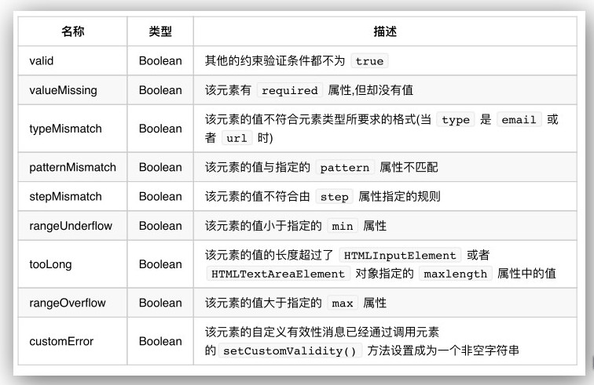

# HTML 5 简介
### HTML 5 简介
- HTML5 是 HTML 标准的下一个重要版本，用来替代 HTML 4.01，XHTML 1.0 以及 XHTML 1.1。HTML5 也是一种在万维网上构建和呈现内容的标准。
- HTML5 是万维网联盟（W3C）和网页超文本技术工作小组（WHATWG）合作的产物。
- HTML5 是近十年来 Web 开发标准最巨大的飞跃。HTML5 并非仅仅用来表示 Web 内容，它将 Web 带入一个成熟的应用平台，在 HTML5 平台上，视频、音频、图象、动画，以及同电脑的交互都被标准化。

### HTML 5 引入的主要特性
- 新的语义化元素： 比如 `<header>` ， `<footer>` 和 `<section>` 。
- 表单 2.0： 改进了 HTML Web 表单，为 `<input>` 标签引入了一些新的属性。
- 持久的本地存储： 为了不通过第三方插件实现。
- WebSocket： 用于 Web 应用程序的下一代双向通信技术。
- 服务器推送事件： HTML5 引入了从 Web 服务器到 Web 浏览器的事件，也被称作服务器推送事件（SSE）。
- Canvas： 支持用 JavaScript 以编程的方式进行二维绘图。
- 音频和视频： 在网页中嵌入音频或视频而无需借助第三方插件。
- 地理定位： 用户可以选择与我们的网页共享他们的地理位置。
- 拖放： 把同一网页上的条目从一个位置拖放到另一个位置。

### HTML 5 浏览器支持
- 最新版 Apple Safari，Mozilla FireFox 和 Opera 支持大部分 HTML5 新特性，IE9 也支持一些 HTML5 的新功能。
- 预装在 iPhones，iPads 和 Android 手机上的手机浏览器都对 HTML5 有良好的支持
- 注：IE 8及之前版本浏览器基本不支持 HTML5 新特性

### HTML 5 新语义标签
- header 元素
	- header 元素代表“网页”或“section”的页眉。
	- 通常包含h1-h6元素或hgroup，作为整个页面或者一个内容块的标题。
	- 也可以包裹一节的目录部分，一个搜索框，一个nav，或者任何相关logo。
	- 整个页面没有限制header元素的个数，可以拥有多个，可以为每个内容块增加一个header元素
	- 注意事项: 
		- 可以是“网页”或任意“section”的头部部分；
		- 没有个数限制。
		- 如果hgroup或h1-h6自己就能工作的很好，那就不要用header。
- footer 元素
	- footer元素代表“网页”或“section”的页脚
	- 通常含有该节的一些基本信息，譬如：作者，相关文档链接，版权资料。
	- 如果footer元素包含了整个节，那么它们就代表附录，索引，许可协议，标签，类别等一些其他类似信息。
	- 注意事项: 
		- 可以是“网页”或任意“section”的底部部分；
		- 没有个数限制，除了包裹的内容不一样，其他跟header类似。
- hgroup元素
	- hgroup元素代表“网页”或“section”的标题
	- 当元素有多个层级时，该元素可以将h1到h6元素放在其内
	- 譬如文章的主标题和副标题的组合
	- 注意事项: 
		- 如果只需要一个h1-h6标签就不用hgroup
		- 如果有连续多个h1-h6标签就用hgroup
		- 如果有连续多个标题和其他文章数据，h1-h6标签就用hgroup包住，和其他文章元数据一起放入header标签。
- nav元素
	- nav元素代表页面的导航链接区域。用于定义页面的主要导航部分。
	- 用在整个页面主要导航部分上。可以把导航条标签ul放到nav里面
- article元素
	- article代表一个在文档，页面或者网站中自成一体的内容，其目的是为了让开发者独立开发或重用。
	- 譬如论坛的帖子，博客上的文章，一篇用户的评论，一个互动的widget小工具。  
	- 注意事项: 
		- 一张页面可以用section划分为简介、文章条目和联系信息。不过在文章内页，最好用article。section不是一般意义上的容器元素，如果想作为样式展示和脚本的便利，可以用div。
		- article、nav、aside可以理解为特殊的section，所以如果可以用article、nav、aside就不要用section，没实际意义的就用div
		- article元素可以嵌套article也可以嵌套section. 也可以section 元素嵌套 article 这是一种特殊情况
- section元素
	- section元素代表文档中的“节”或“段”
	- “段”可以是指一篇文章里按照主题的分段；“节”可以是指一个页面里的分组。
	- section通常还带标题，虽然html5中section会自动给标题h1-h6降级，但是最好手动给他们降级
	- 注意事项: 
		- 一张页面可以用section划分为简介、文章条目和联系信息。不过在文章内页，最好用article。section不是一般意义上的容器元素，如果想作为样式展示和脚本的便利，可以用div。
		- 表示文档中的节或者段；
- aside元素 (次要信息)
	- aside元素被包含在article元素中作为主要内容的附属信息部分，其中的内容可以是与当前文章有关的相关资料、标签、名词解释等。（特殊的section）
	- 在article元素之外使用作为页面或站点全局的附属信息部分。最典型的是侧边栏，其中的内容可以是日志串连，其他组的导航，甚至广告，这些内容相关的页面。
	- 注意事项: 
		- aside在article内表示主要内容的附属信息
		- 在article之外则可做侧边栏，没有article与之对应，最好不用。
		- 如果是广告，其他日志链接或者其他分类导航也可以用

### HTML 5 表单
#### 表单新类型
- email 类型
	- email 类型是专门用于输入 email 地址的文本框
	- 在提交表单时会检查 email 类型的文本框中是否包含 @ 符合
	- 注：email 类型的文本框并不能检查 email 地址是否真实存在
	- 语法：`<input type="email"/>`
- url 类型
	- url 类型是专门用于输入 url 地址的文本框
	- 表单提交时，检查 url 类型的文本框中是否包含 http:// 符号
	- 语法：`<input type="url"/>`
- search 类型
	- search 类型是专门用于输入搜索关键词的文本框
	- 在移动设备中，当 search 类型的元素获取焦点时，键盘的“前往”会改为“搜索”字样
	- 注：在 PC 端浏览器 search 类型与 text 类型外观相同
	- 语法：`<input type="search"/>`
- tel 类型
	- tel 类型是专门用于输入电话号码的文本框
	- 在移动设备中，当 tel 类型的元素获取焦点时，键盘会使用数字面板
	- 注：该元素没有特殊的检验规则，不强制输入数字
	- 语法：`<input type="tel">`
- number 类型
	- number 类型是专门用于输入数字的文本框
	- 提交表单时，检查 number 类型的文本框中是否为数字
	- 语法：`<input type="number" min="0" max="100" step="5"/>`
		- min -- 允许输入的最小数值
		- max -- 允许输入的最大数值
		- step -- 设置增加或减小的间隔（步长）
- date 类型
	- date 类型是专门用于输入日期，提供日期选择控件
	- 当用户单击向下箭头按钮时浏览器页面中显示日历
	- 语法：`<input type="date"/>`
- range 类型
	- range 类型是专门用于输入一定范围内数字值
	- range 类型在 HTML 页面中显示为滑动条
	- 语法：`<input type="range" min="0" max="100" step="5" value="50"/>`
		- min -- 允许输入的最小数值
		- max -- 允许输入的最大数值
		- step -- 设置增加或减小的间隔（步长）
		- value -- 设置滑动条的当前值
- color 类型
	- color 类型是专门用于选取颜色的
	- color 类型提供了一个颜色选择器
	- 当用户单击 color 类型弹出颜色选择器
	- 语法：`<input type="color"/>`

#### 表单新元素
- datalist 元素
	- `<datalist>`元素规定输入域的选项列表
	- `<datalist>`属性规定 form 或 input 域应该拥有自动完成功能
	- 使用 `<input>`元素的列表属性与`<datalist>`元素绑定
		```
			<input list="browsers">
			<datalist id="browsers">
				<option value="Internet Explorer">
				<option value="Firefox">
				<option value="Chrome">
				<option value="Opera">
				<option value="Safari">
			</datalist>
		```
- progress 元素
	- `<progress>` 标签表示进度条，用于显示一个任务的完成进度
	- 属性
		- max -- 规定需要完成的值
		- value -- 规定进程的当前值
	- 注：请将`<progress>`标签与 JavaScript 一起使用来显示任务的进度
	- 注：`<progress>`标签不适合用来表示度衡量（例如，磁盘空间使用情况或相关的查询结果）。表示度衡量，使用`<meter>`标签代替
	- 实例代码
		```
			<progress id="progress" max="100" value="0"></progress>
			<script>
				var progress = document.getElementById("progress");
				var max = progress.max;
				var t = setInterval(function(){
				var v = progress.value;
					if(v == max){
				clearInterval(t);
				}else{
				v++;
				progress.value = v;
				}
				},100);
			</script>
		```
- meter 元素
	- `<meter>`标签定义度衡量，仅用于已知最大和最小值的度量
	- 比如：磁盘使用情况，查询结果的相关性等
	- 属性
		- high -- 规定被界定为高的值的范围
		- low -- 规定被界定为低的值的范围
		- max -- 规定范围的最大值
		- min -- 规定范围的最小值
		- value -- 必需。规定度量的当前值
	- 注：`<meter>`不能作为一个进度条来使用
	- 语法：`<meter min="0" max="100" value="95" low="10" high="90"></meter>`
- output 元素
	- `<output>`元素用于不同类型的输出，比如计算或脚本输出
	- 实例代码
		```
			<form oninput="x.value=parseInt(a.value)+parseInt(b.value)">0
				<input type="range" id="a" value="50">100 +
				<input type="number" id="b" value="50">=
				<output name="x" for="a b"></output>
			</form>
		```

#### 表单新属性
- placeholder 属性
	- placeholder 属性提供一种提示，描述输入域所期待的值
	- 注：placeholder 属性适用于以下类型的`<input>`标签：text，search，url，telephone，email 以及 password
	- 语法：`<input type="text" name="fname" placeholder="First name">`
- autofocus 属性
	- autofocus 属性规定在页面加载时，域自动获取焦点
	- 语法：`First name:<input type="text" name="fname" autofocus>`
- multiple 属性
	- multiple 属性规定`<input>`元素中可选择多个值
	- 注：multiple 属性适用于以下类型的`<input>`标签：email 和 file
	- 语法：`Email: <input type="email" multiple>` 
- form 属性
	- form 属性规定输入域所属的一个或多个表单
	- 注：如需引用一个以上的表单，请使用空格分隔列表
	- 实例代码
		- 位于form表单外的input字段引用了 HTML form (该 input 表单仍然属于form表单的一部分)
		```
			<form action="demo-form.php" id="form1">
				First name: <input type="text" name="fname"><br>
				<input type="submit" value="Submit">
			</form>
			Last name: <input type="text" name="lname" form="form1">
		```

### 表单验证
#### 验证属性
- required 属性
	- required 属性规定必须在提交之前填写输入域（不能为空）
	- 注：required 属性适用于以下类型的 `<input>` 标签： text , search , url , telephone , email , password , date pickers , number , checkbox , radio 以及 file
	- 语法：`Username: <input type="text" name="usrname" required>`
- pattern 属性
	- pattern 属性的值与指定的正则表达式进行匹配（一般用于验证特定格式）
	- 注： pattern 属性适⽤用于以下类型的 `<input>` 标签: text , search , url , tel , email , 和 password
	- 语法：`Country code: <input type="text" name="country_code" pattern="[A-Za-z]{3}" title="Three let>`
- min 和 max 属性
	- min、max 和 step 属性用于为包含数字或日期的 input 类型规定限制（约束）
	- 注：min、max 和 step 属性适用于以下类型的`<input>`标签：date pickers、number 以及 range
	- 实例代码
		```
			Enter a date before 1980-01-01:
			<input type="date" name="bday" max="1979-12-31">
			Enter a date after 2000-01-01:
			<input type="date" name="bday" min="2000-01-02">
			Quantity (between 1 and 5):
			<input type="number" name="quantity" min="1" max="5">
		```
- maxlength 属性
	- maxlength 属性用于设定允许输入的最大字符的个数
	- 注：maxlength 属性应该叫做限制属性

#### 有效状态
- ValidityState 代表了一个元素可以处于的与约束验证相关的有效性状态 
 
- 实例代码
	```
		<form>
			用户名:<input id="user" type="text" required><br>
			密码:<input id="pwd" type="text" pattern="^[0-9]{6,8}$"><br>
			Email:<input id="mail" type="email"><br>
			年龄:<input id="age" step="5" type="number" min="20"><br>
			<input type="submit">
		</form>
		<script>
			var user = document.getElementById("user");
			user.onblur = function(){
				if(user.validity.valid){
					alert("验证通过.");
				}else if(user.validity.valueMissing){
					alert("用户名为空.");
				}
			}
			var pwd = document.getElementById("pwd");
			pwd.onblur = function(){
				if(pwd.validity.valid){
					alert("验证通过.");
				}else if(pwd.validity.patternMismatch){
					alert("密码输入有误.");
				}
			}
			var mail = document.getElementById("mail");
			mail.onblur = function(){
				if(mail.validity.valid){
					alert("验证通过.");
				}else if(mail.validity.typeMismatch){
					alert("Email输入有误.");
				}
				}
			var age = document.getElementById("age");
			age.onblur = function(){
				if(age.validity.valid){
					alert("验证通过.");
				}else if(age.validity.rangeUnderflow){
					alert("年龄过小.");
				}else if(age.validity.stepMismatch){
					alert("年龄有误.");
				}
			}
		</script>
	```

#### setCustomValidity() 方法
- setCustomValidity() 方法设置自定义验证信息，用于即将实施与验证的约束来覆盖预定义的信息
- 实例代码
	```
		<form>
			<input id="data" type="text" required>
			<input type="submit">
		</form>
		<script>
			var data = document.getElementById("data");
			data.onblur = function(){
				if(data.validity.valueMissing){
					data.setCustomValidity("不能为空.");
				}else if(data.validity.customError){
					data.setCustomValidity("");
				}
			}
		</script>
	```