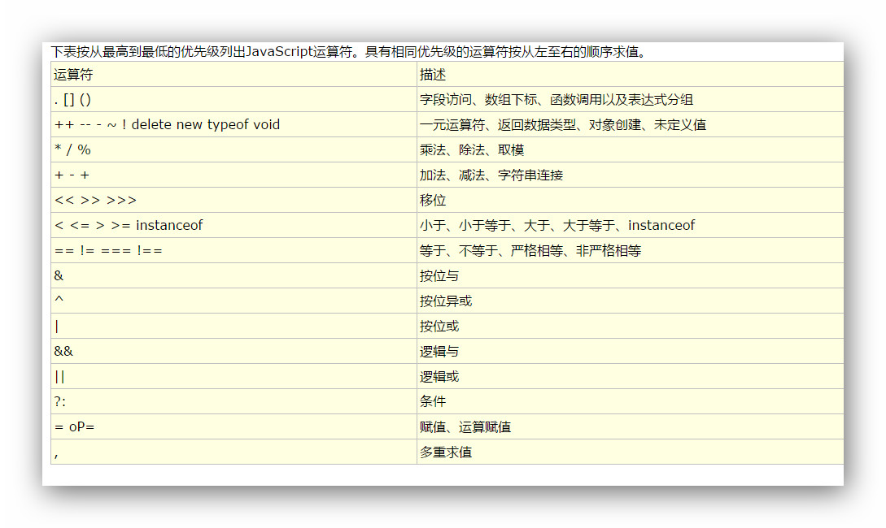

# JS 运算符
### 算数一元运算符
- 一元加号
	- 一元加号相当于数学运算中的正号
	- 不会对一个数值产生任何变化
- 一元减号
	- 一元减号相当于数学运算中的负号
	- 负号可以对一个数值进行符号位取反

### 算数二元运算符
- +加号
	- 对符号两侧的值进行加法运算并将结果返回
	- 对非数字(除了字符串)进行加法运算时,它会将其先转换为数字,然后再运算
	- 任何值和 NaN 做任何运算都返回 NaN
	- 对两个字符串进行相加,则会进行拼串的操作
- -减号
	- 减号可以对符号两侧的值进行减法运算
- *乘号
	- 乘法可以对符号两侧的值进行乘法运算
- /除号
	- 除法可以对符号两侧的值进行除法运算
- %取模
   - % 可以对符号两侧的值进行取模（取余数）运算
   - 同样对非数字进行取余数的运算,也会转换为数字然后运算
   - 第一个计算值为负值时--求余的值就是负值
   - 第一个计算值为正值时--求余的值就是正值
- 注：加法、减法、除法、乘法、取模对字符串中非数字运算的结果都为 NaN

### 自增自减
- 自增
	- 指在变量原值基础上增加一个 1
	- 后++(a++)的值是变量自增前的值(变量的原值)
	- 前++(++a)的值是变量自增后的值(变量的新值)
	- 无论是前++还是后++都会立即使原变量自增 1，调用几次就自增几次
- 自减
	- 指在变量原值基础上减少一个 1
	- 后-- (a--)的值是变量自减前的值(变量原值)
	- 前--(--a)的值是变量自减后的值(变量新值)
	- 无论是前--还是后--都会使原变量立即自减 1

### 逻辑运算符
- ！ 逻辑非
	- 为一个布尔值取反
	- true 变成 false ， false 变成 true
	- 如果对一个非布尔值进行取反操作，他会先将其转换为布尔值，然后在取反
- && 逻辑与
	- && 可以对符号两侧的值进行与计算
	- 两端只有都是 true 时，才会返回 true，只要有一个是 false 就会返回 false
	- JS 中如果与运算符的第一个值是 false，则不看第二个值，直接执行结果
- || 逻辑或
	- || 可以对符号两侧的值进行或运算
	- 只要有一个为 true，就会返回 true，两端只有都是 false 时，才会返回 false
	- JS 中如果或运算符的第一个只是 true，则不看第二个值，直接执行结果

- 非布尔值的与运算
	- 如果两个值都为 true，则返回后边的
	- 如果两个值都为 false，则返回前面的 false
	- 如果第一个值为 false，则返回第一个；如果第一个值是 true，则返回第二个值
- 非布尔值的或运算
	- 如果两个值都为 true，则返回前面的 true
	- 如果两个值都为 false，则返回后边的
	- 如果第一个值为 true，则返回第一个；如果第一个值为 false，则返回第二个

### 赋值运算符
- = 赋值
	- 可以将等号右边的值赋值给等号左边的变量
	- 一些特殊的赋值
		```
			+= -- a+=x 等价于a=a+x
			-= -- a-=x 等价于a=a-x
			*= -- a*=x 等价于a=a*x
			/= -- a/=x 等价于a=a/x
			%= -- a%=x 等价于a=a%x
		```

### 关系运算符
- 可以比较两个值之间的大小关系
- 如果对非数值类型进行关系运算，则会将他们转换为 number，然后在比较
- 当关系运算符两侧都是字符串时，他不会将字符串转换为 number，而是会直接比较字符串的 Unicode 编码
- 当字符串中含义多个字符时，会逐位进行比较
- NaN 和任何值比较都是 false，包括他自己
```
	> -- 大于号,比较符号左侧的值是否大于右侧的值,如果关系成立返回true,否则返回false
		
	>= -- 大于等于号,比较左侧的值是否大于或等于右侧的值,如果关系成立返回true,否则返回false
		
	< -- == 小于号 比较符号左侧的值是否小于右侧的值,如果关系成立返回true,否则返回false
		
	<= -- 小于等于号,比较左侧的值是否小于或等于右侧的值,如果关系成立返回true,否则返回false
```

### 相等运算符和全等运算符
- == 相等运算符
	- 判断两个值是否相等
	- 相等返回 true
	- 不相等返回 false
	- 如果对两个类型不同的变量进行相等比较,先将其转换为相同的类型,然后再比较

- === 全等运算符
	- 先判断两个数据的类型是否相同，如相同则比较数据的值是否相等
	- 不等则返回 false
	- 全等和相等的区别就是相等会自动转换数据类型，全等不会

- ！= 不等运算符
	- 如果两个值不等则返回 true
	- 不等运算符会自动转换数据类型，如果转换后还不相等，则返回 true

- ！== 全不等
	- 先比较两个数据的类型是否相同，相同再比较其值是否相等，都相等则返回 false，如果类型不相同，则直接返回 true
- isNaN()
	- 专门判断一个值是否是NaN,如果是返回true,否则返回false

### 三元运算符（三目运算符）
- 三元运算符需要三个操作数
- 语法
	- 条件表达式 ？ 语句1 ： 语句2
- 执行流程
	- 先对条件表达式求值判断
	- 如果判断结果为true,则执行语句1,并将执行结果返回
	- 如果判断结果为false 则执行语句2,并将执行结果返回
	
### 运算符优先级	

