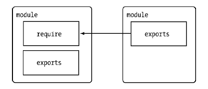

# Common.Js
### 简介
- CommonJs 视图定义一套普通应用程序使用的 API，从而填补 JavaScript 标准库过于简单的不足
- CommonJs 拟定一套完整的规范，用来规范譬如文件系统访问、命令行、模块管理、函数库集成等功能
- CommonJs 两大核心 -- exports/require 组合和 package.json

### CommonJs 模块系统
- exports -- 暴露文件
- require -- 引入文件
 

### package.json
- json 里不可以加注释
- package.json 所需的属性
	- name -- 名（必须）
	- version -- 版本号（必须）
	- main -- 程序执行的入口地址
	- cripts -- 项目生命周期各环节需要执行的命令(对象)
 	- dependencies -- 项目运行依赖的模块(对象) npm install express --save  
 	- devDependencies -- 项目开发所需模块(对象) npm install express --save-dev
 	  
> 注意
> name 和 version 属性共同确定了一个包