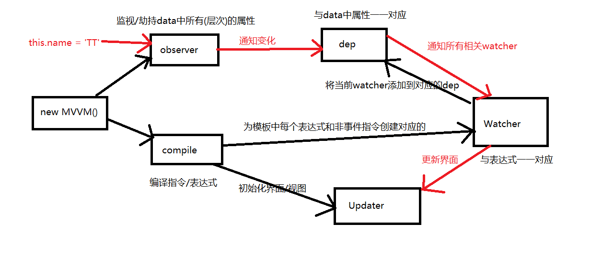

# 源码分析
### 数据代理(MVVM.js)
- 通过一个对象代理另一个对象中的属性，并对其进行操作（读/写）
- 通过 vm 对象来代理 data 对象中所有属性的操作
- 好处 -- 更方便的操作 data 中的数据
- 基本实现流程
	- 通过 Object.defineProperty(vm,key,{}) 给 vm 添加与 data 对象的属性对应的属性
	- 所有添加的属性都包含 get/set 方法
	- 在 get/set 方法中去操作 data 中对应的属性
- MVVM 数据代理代码的分析
```
	function MVVM(options) {
		// 1、将配置对象（new MVVM 中的内容）保存到 MVVM 的实例对象（vm）中
		this.$options = options; 
		// 2、将配置对象中的 data 保存到 vm 的 _data 以及变量data 中
		var data = this._data = this.$options.data; 
		// 3、将 vm 对象保存到 me 中（缓存 vm 对象）
		var me = this;    
	    // 4、遍历 data 中的所有属性，并实现对它的代理
		// 实现 vm.xxx -> vm._data.xxx
		Object.keys(data).forEach(function(key) {
			// 5、实现对key的数据代理
			me._proxy(key); 
		});
	
		observe(data, this);
	
		this.$compile = new Compile(options.el || document.body, this)
	}
	// 将 _proxy 保存在构造函数的原型中，实例对象（vm）就可以使用
	MVVM.prototype = {
		$watch: function(key, cb, options) {
			new Watcher(this, key, cb);
	    },
	
	    _proxy: function(key) {
			// 将 vm 对象保存到 me 中（缓存 vm） 
	        var me = this;
	        // 使用 defineProperty 为 me 添加属性，以实现对 key 的代理
	        Object.defineProperty(me, key, {
				// 不可修改
	            configurable: false,  
				// 属性可枚举
	            enumerable: true,  
				// 设置 get 方法，当读取 vm.xxx 时，会调用此方法得到对应的属性
	            get: function proxyGetter() { 
	                return me._data[key];
	            },
				// 设置 set 方法，当 vm.xxx 的值改变时，修改 _data 中对应的属性的值 
	            set: function proxySetter(newVal) { 
	                me._data[key] = newVal;
	            }
	        });
	    }
	};
```

### 模板解析(compile.js)
- 模板解析的关键对象 -- compile 对象
- 模板解析的基本流程
	- 将 el 的所有子节点取出，添加到一个新建的文档 fragment 对象中
	- 对 fragment 中的所有层次子节点递归进行编译解析处理
		- 对表达式文本节点进行解析
		- 对元素节点的指令属性进行解析
			- 事件指令解析
			- 一般指令解析
		- 将解析后的 fragment 添加到 el 中显示
	- 解析表达式文本节点
		- 根据正则对象得到匹配出的表达式字符串 -- 子匹配/RegExp.$1
		- 通过 vm 从 data 中取出表达式对应的属性值
		- 将属性值设置为文本节点的 textContent
	- 事件指令解析
		- 从指令中取出事件名
		- 根据指令的值（表达式）从 methods 中得到对应的事件处理函数对象
		- 给当前元素节点绑定指定的事件名和回调函数的 DOM 事件监听
		- 指令解析完后，移除此指令属性
	- 一般指令解析
		- 得到指令名和指令值（表达式） -- text/html/class -- msg/myClass
		- 从 data 中根据表达式得到对应的值 -- 表达式在 data 中的值
		- 根据指令名确定需要操作元素节点的什么属性
			- v-text -- textContent 属性 -- textUpdater()
			- v-html -- innerHtml 属性 -- htmlUpdater()
			- v-class -- className 属性 -- classUpdater()
		- 将得到的表达式的值设置到对应的属性上
		- 移除元素的指令属性
	- 源码分析
	
```
function Compile(el, vm) {
	// 将 vm 对象保存入 compile 的 $.vm 中
    this.$vm = vm;
    // 判断 el 是否是元素节点，如果是则将 el 保存到实例对象 compile 中，如果不是则去寻找 el 所指的元素，在保存
    this.$el = this.isElementNode(el) ? el : document.querySelector(el);
    // 如果元素存在才去解析
    if (this.$el) {
        // 创建 fragment 对象，取出根元素中所有子元素，将其添加到fragment中
        this.$fragment = this.node2Fragment(this.$el);
        // 初始化: 编译 fragment 中所有的模板
        this.init();
        // 将fragment添加到根元素中显示
        this.$el.appendChild(this.$fragment); // 第二次更新界面
    }
}

Compile.prototype = {
    /*
	node2Fragment: function(el) {
        // 创建一个空的 fragment 对象
        var fragment = document.createDocumentFragment(),
          child;
        // 遍历取出所有的子元素添加到 fragment 中
        while (child = el.firstChild) {
            fragment.appendChild(child); 
			// child 会从 el 中转移到 fragment 中，且页面上的内容会消失
        }

        return fragment;
    },
	*/
	//  此处不太好，每遍历一次页面就会刷新一次
 
	node2Fragment: function(el) {

        // 得到el的所有子节点的字符串
        const innerStr = el.innerHTML
        // 一次性清空el的所有子节点
        el.innerHTML = ''  // 第一次更新

        // 将标签结构字符串转换为标签对象
        const div = document.createElement('div')
        div.innerHTML = innerStr

        // 将div中所有的子节点添加到fragment中
        var fragment = document.createDocumentFragment(),
            child;
        // 将原生节点拷贝到fragment
        while (child = div.firstChild) {
            fragment.appendChild(child); // 此处不会更新界面
        }

        return fragment;
    },
	// 此种方法比上一种好在，总共只更新两次界面，总体遍历完后更新一次，最后渲染更新一次

    init: function() {
        // 编译 fragment 中所有的模板子元素
        this.compileElement(this.$fragment);
    },

    compileElement: function(el) {
        // 得到所有的子节点(包括换行文本节点)
        var childNodes = el.childNodes,
            me = this;
        // 遍历所有子节点，一个一个编译
        [].slice.call(childNodes).forEach(function(node) {
            // 得到当前节点的文本内容
            var text = node.textContent;
            // 定义匹配表达式的正则
            var reg = /\{\{(.*)\}\}/;
            // 如果当前遍历的节点是元素点
            if (me.isElementNode(node)) {
                // 编译当前节点其中的指令属性
                me.compile(node);

            // 当前节点是一个表达式格式的文本节点
            } else if (me.isTextNode(node) && reg.test(text)) {
                //编译表达式文本节点
                me.compileText(node, RegExp.$1);
            }

            // 如果当前节点还有子节点
            if (node.childNodes && node.childNodes.length) {
                //编译当前节点元素(的子节点): 形成递归调用编译, 从而实现对任意层次的模板的编译
                me.compileElement(node);
            }
        });
    },

    compile: function(node) {
        // 取出节点中的所有属性
        var nodeAttrs = node.attributes,
            me = this;
        // 遍历属性 -- 编译指令属性
        [].slice.call(nodeAttrs).forEach(function(attr) {
            // 得到属性名 -- v-on：click
            var attrName = attr.name;
            // 根据属性名判断是否是指令属性
            if (me.isDirective(attrName)) {
                // 得到指令表达式 -- read
                var exp = attr.value;
                // 得到指令名 -- text/html/model/on:click
                var dir = attrName.substring(2);
                // 如果是事件指令
                if (me.isEventDirective(dir)) {
                    // 处理事件指令
                    compileUtil.eventHandler(node, me.$vm, exp, dir);
                } else {// 普通指令
                    // 调用普通指令所对应的处理方法处理
                    compileUtil[dir] && compileUtil[dir](node, me.$vm, exp);
                }
                // 编译指令完成后，删除指令属性
                node.removeAttribute(attrName);
            }
        });
    },

    /*
    编译文本节点
     */
    compileText: function(node, exp) {
        compileUtil.text(node, this.$vm, exp);
    },

    /*
    判断是否是指令属性
     */
    isDirective: function(attr) {
        return attr.indexOf('v-') == 0;
    },

    /*
    判断指令是否是事件指令
     */
    isEventDirective: function(dir) {
        return dir.indexOf('on') === 0;
    },

    /*
    判断是否是元素节点
     */
    isElementNode: function(node) {
        return node.nodeType == 1;
    },

    /*
    判断是否是文本节点
     */
    isTextNode: function(node) {
        return node.nodeType == 3;
    }
};

/*
表达式/指令的编译工具对象
 */
var compileUtil = {
    /*
    编译表达式
     */
    text: function(node, vm, exp) {
        this.bind(node, vm, exp, 'text');
    },

    /*
     编译v-html
     */
    html: function(node, vm, exp) {
        this.bind(node, vm, exp, 'html');
    },

    /*
    编译v-model
     */
    model: function(node, vm, exp) {
        this.bind(node, vm, exp, 'model');

        var me = this,
          // 获取当前表达式的值
            val = this._getVMVal(vm, exp);
        // 给节点绑定input监听: 一旦input的value变化, 回调函数就执行
            // 用来实现双向数据绑定
        node.addEventListener('input', function(e) {
            // 得到输入框最新的值
            var newValue = e.target.value;
            // 如果值没有变化, 不做任何处理
            if (val === newValue) {
                return;
            }
            // 将最新的值保存到对应的属性上
            me._setVMVal(vm, exp, newValue);
            // 保存最新的值
            val = newValue;
        });
    },

    /*
    编译v-class
     */
    class: function(node, vm, exp) {
        this.bind(node, vm, exp, 'class');
    },


    bind: function(node, vm, exp, dir) {
        // 得到真正将指令/表达式更新为对应值的函数
        var updaterFn = updater[dir + 'Updater'];
        // 如果存在, 执行最后的解析工作
            // _getVMVal(vm, exp)
        updaterFn && updaterFn(node, this._getVMVal(vm, exp));
        // 为每个一般指令/表达式创建一个对应的watcher
            //用来监视对应数据的变化, 一旦变化, 再次调用指令/表达式的处理函数
        new Watcher(vm, exp, function(value, oldValue) {
            updaterFn && updaterFn(node, value, oldValue);
        });
    },

    // 事件指令处理
    eventHandler: function(node, vm, exp, dir) {
        // 根据指令名得到事件类型(名) -- click
        var eventType = dir.split(':')[1],
          //事件回调函数（function read()），判断 vm 中是否设置了 method，且回调是否存在
            fn = vm.$options.methods && vm.$options.methods[exp];
        // 如果事件名与回调函数都存在
        if (eventType && fn) {
            // 给节点添加指定类型的事件监听
                //fn.bind(vm): 指定回调函数中的 this 为 vm 对象
            node.addEventListener(eventType, fn.bind(vm), false);
        }
    },

    /*
    得到指定表达式的值
        表达式可能是多层组成, 需要一层一层来遍历
     */
    _getVMVal: function(vm, exp) {
        var val = vm._data;
        exp = exp.split('.');

        exp.forEach(function(k) {
            val = val[k];
        });
        return val;
    },

    /*
    给指定表达式设置指定的新值
     */
    _setVMVal: function(vm, exp, value) {
        //得到data对象
        var val = vm._data;
        exp = exp.split('.');
            exp.forEach(function(k, i) {
                // 找到最内层属性并设置为指定的value
                if (i < exp.length - 1) {
                    val = val[k];
                } else {
                    val[k] = value;
                }
        });
    }
};


var updater = {
    /*
    更新标签体文本: v-text/表达式
     */
    textUpdater: function(node, value) {
        node.textContent = typeof value == 'undefined' ? '' : value;
    },
    /*
     更新标签体html: v-html
     */
    htmlUpdater: function(node, value) {
        node.innerHTML = typeof value == 'undefined' ? '' : value;
    },

    /*
     更新标签的class属性值: v-class
     */
    classUpdater: function(node, value, oldValue) {
        var className = node.className;
        className = className.replace(oldValue, '').replace(/\s$/, '');

        var space = className && String(value) ? ' ' : '';

        node.className = className + space + value;
    },

    /*
    更新标签的value: v-model
     */
    modelUpdater: function(node, value, oldValue) {
        node.value = typeof value == 'undefined' ? '' : value;
    }
};
```
		


### 数据劫持 --> 数据绑定
#### 数据绑定
- 界面的显示是通过读取 data 中对应的数据来显示的（初始化）
- 一旦更新了 data 中的某个属性数据，所有界面上直接使用或间接使用了此属性的节点都会更新

#### 数据劫持
- 数据劫持是 vue 中用来实现数据绑定的一种技术
- 基本思想 -- 通过 defineProperty() 来监视 data 中的所有属性（任意层次）数据的变化，一旦变化就去更新界面

#### 四个重要对象
- Observer
	- 用来对 data 及 data 所有属性数据进行劫持的构造函数
	- data 对象以及 data 内部所有的子对象，都会创建一个对应的 observer 对象
	- 为 data 中的每个属性创建对应的 dep 对象
	- observer 与 dep 的关系：一对多
- Dep(Depend)
	- data 中的每个属性（所有层次）都对应一个 dep 对象
	- 创建的时机
		- 在初始化 define data 中的各个属性时创建对应的 dep 对象
		- 在 data 中的某个属性值被设置为新的对象时
	- 对象的结构
		```
		{
			id,   // 每个 dep 都有一个的唯一属性
			subs  // 包含 n 个对应 watcher 的数组
		}
		```
	- subs 属性说明
		- 当一个 watcher 被创建时，内部会将当前的 watcher 对象添加到对应的 dep 对象的 subs 中
		- 当此 data 属性的值发生改变时，所有 subs 中相关的 watcher 都会收到更新的通知，从而最终更新对应的界面
	- Compile
		- 用来解析模板页面的对象的构造函数（一个实例）
		- 利用 compile 对象解析模板页面
		- 每解析一个表达式（非事件指令）都会创建一个对应的 watcher 对象，并建立 watcher 与  dep 的关系
		- compile 与 watcher 的关系：一对多的关系
	- Watcher
		- 模板中每个非事件指令或表达式都对应一个 watcher 对象
		- 监视当前表达式数据的变化
		- 创建的时机 -- 在初始化编译模板时
		- 对象的组成
			```
				{
					vm,   // vm 对象
					exp,  // 对应指令的表达式
					cb,   // 当前表达式所对应的数据发生改变时的回调函数
					value, // 表达式当前的值
					depIds // 表达式中各级属性所对应的 dep 对象的集合，属性名为 dep 的 id，属性值为 dep
					
				}
			```
	- 总结
		- dep 与 watcher 的关系：多对多
		- 一个 data 中的属性对应一个 dep，一个 dep 中可能包含多个 watcher（模板中有几个表达式使用到了属性）
		- 模板中一个非事件表达式对应一个 watcher，一个 watcher 中可能包含多个 dep（表达式中包含了几个 data 属性）
		- 数据绑定使用到的2个核心技术
			- defineProperty()
			- 消息订阅与发布

#### 双向数据绑定
- 双向数据绑定是建立在单向数据绑定(model=>view)的基础之上的
- 双向数据绑定的实现流程
	- 在解析 v-modal 指令时，给当前元素添加 input 监听
	- 当 input 的 value 发生改变时，将最新的值赋给当前表达式所对应的 data 属性 



